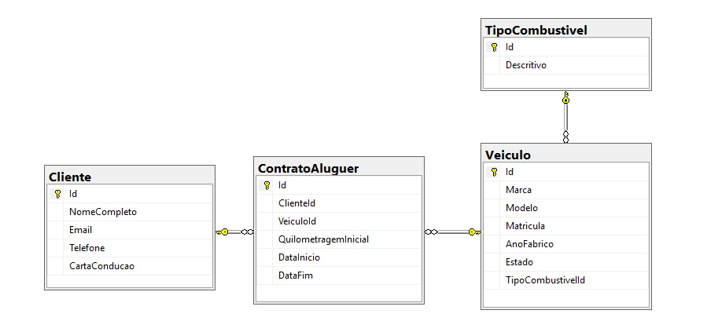
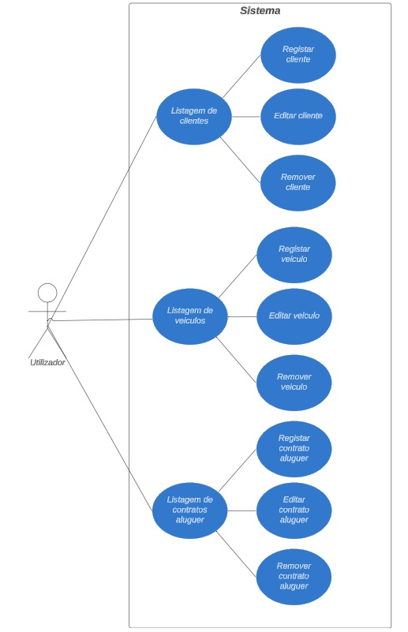

# DesafioGrupoJap

# Ordem de Tarefas

- Criar um projeto **MVC ASP.NET CORE**.
- Criar o **DbContext** e configurar o `appsettings.json` para conseguir acessar à base de dados **SQL Server**.
- Fiz um loop por cada modelo de dados:
  - Criar o modelo de dados respectivo.
  - Criar uma migração para criar o modelo de dados (tabela) no **SQL Server**.
  - Criar o controlador respectivo, contendo toda a lógica de validações e carregamento de dropdowns (se necessário).
  - Criar a view respectiva.
  - Testar o fluxo (Criar, Editar, Detalhes, Remover).
- Criar a **view** da página principal.
- Testar o fluxo na totalidade: criar um cliente, criar um veículo, criar um contrato com esse cliente e veículo.

---

## Planejamento

Após ler os requisitos funcionais, comecei por criar as tarefas que teria pela frente e ordená-las de forma que nenhuma dependesse de uma tarefa seguinte no momento em que estivesse sendo desenvolvida.

---

## Modelo de dados

Aqui está o modelo de dados.

---

## Melhorias Implementadas

### Modelo Veículo

Para melhorar a qualidade dos dados do modelo **Veículo**, optei por criar uma tabela auxiliar (**TipoCombustivel**) com os tipos de combustíveis existentes. Assim, o Utilizador só poderá atribuir tipos de combustíveis válidos e evitar nomes aleatórios. Essa alteração impactou as validações das regras de negócio. 

Outra validação adicionada foi que um veículo já associado a um contrato não pode ser removido. Essa validação poderia ser evitada caso utilizasse a abordagem do **Soft Delete**.

#### Validações de Obrigatoriedade:
- **Marca, Modelo, Matrícula, Ano de Fabrico e Tipo de Combustível**: Campos obrigatórios.

#### Validações de Regras de Negócio:
- **Ano de Fabrico**: Não pode ser posterior ao ano atual.
- **Matrícula**: Deve ser única (não podem existir dois veículos com a mesma matrícula).
- **Tipo de Combustível**: Deve existir na tabela auxiliar **TipoCombustivel**.
- **Veículo**: Não pode ser removido se já estiver associado a um contrato.

---

### Modelo Cliente

Para melhorar a qualidade dos dados do modelo **Cliente**, adicionei uma validação de regra de negócio para validar o formato do **e-mail**.

Outra validação adicionada foi que um cliente já associado a um contrato não pode ser removido. Essa validação poderia ser evitada caso utilizasse a abordagem do **Soft Delete**.

#### Validações de Obrigatoriedade:
- **Nome Completo, Email, Telefone, Carta de Condução**: Campos obrigatórios.

#### Validações de Regras de Negócio:
- **Email**: Deve ser único no sistema e estar em um formato válido (não podem existir dois clientes com o mesmo e-mail).
- **Telefone**: Deve conter apenas números e estar em um formato válido de número de telefone.
- **Cliente**: Não pode ser removido se já estiver associado a um contrato.

---

### Modelo Contrato de Aluguer

Para melhorar a qualidade dos dados do modelo **Contrato de Aluguer**, criei uma validação para verificar se o veículo já está reservado durante o período das datas inseridas. 

Exemplo prático: Existe um contrato para o veículo número 1 com **data início** 29/12/2024 e **data fim** 31/12/2024. Como hoje é 28/12/2024, ele está disponível para aluguer, mas deve ser impossível alugá-lo novamente para as mesmas datas.

#### Validações de Obrigatoriedade:
- **Cliente**: Selecionar um cliente da lista (obrigatório).
- **Veículo**: Selecionar um veículo da lista (obrigatório).
- **Data de Início do Aluguer, Data de Fim do Aluguer, Quilometragem Inicial**: Campos obrigatórios.

#### Validações de Regras de Negócio:
- **Data de Início do Aluguer**: Deve ser uma data válida e não pode ser anterior à data atual.
- **Data de Fim do Aluguer**: Deve ser posterior à data de início do aluguer.
- **Veículo**: Só pode estar alugado em um único contrato para as mesmas datas.

---

## Outras Melhorias Possíveis

Poderia ter utilizado o **Soft Delete**. Em vez de excluir a linha na base de dados, criaria um estado de "Ativo" e "Inativo". Assim, seria possível "remover" um veículo atribuído a um contrato de aluguer, mantendo os dados do veículo no contrato.

---

Diagrame de Use Cases

---

# Use Case: Registo de Clientes

---

## **Título:**  
Validação e criação de clientes no sistema

---

## **Descrição:**  
Este caso de uso descreve como o sistema cria os dados dos clientes, sendo aplicadas validações para garantir a qualidade dos dados, evitar duplicidades e assegurar integridade em relação aos contratos de aluguer associados.  

---

## **Ator Principal:**  
Utilizador do sistema.
---

## **Pré-condições:**  
1. Nenhuma p´re-condição.

---

## **Fluxo Principal:**  
1. O sistema acede à listagem de clientes.  
3. O Utilizador seleciona a opção para **adicionar** um cliente.  
4. O sistema solicita as seguintes informações obrigatórias:
   - Nome Completo  
   - Email  
   - Telefone  
   - Carta de Condução  
5. O sistema executa as seguintes validações ao guardar os dados:
   - O **email** deve ser único no sistema e ter um formato válido.  
   - O **telefone** deve conter apenas números e obedecer a um formato válido.  
6. O sistema salva os dados do cliente se todas as validações forem aprovadas.  
7. O Utilizador é direcionado para a listagem de clientes.  

---

## **Fluxo Alternativo 1 (Validação do Email):**  
**Condição:** O email inserido já está em uso ou tem um formato inválido.  
1. O sistema mostra uma mensagem de erro a informar o problema.  
2. O Utilizador corrige o email e tenta guardar novamente.  

---

## **Fluxo Alternativo 2 (Validação do Telefone):**  
**Condição:** O telefone inserido contém caracteres inválidos ou tem um formato inválido.  
1. O sistema mostra uma mensagem de erro a informar o problema.  
2. O Utilizador corrige o telefone e tenta guardar novamente.  

---

## **Fluxo Alternativo 3 (Remoção de um Cliente Associado a um Contrato):**  
**Condição:** O Utilizador tenta remover um cliente que já está associado a um contrato de aluguer.  
1. O sistema impede a remoção e mostra uma mensagem de erro a informar o problema.
2. O Utilizador pode optar por voltar para a listagem de clientes.  

---

## **Pós-condições:**  
1. O cliente é criado e os dados são validados e armazenados corretamente na base de dados.  

